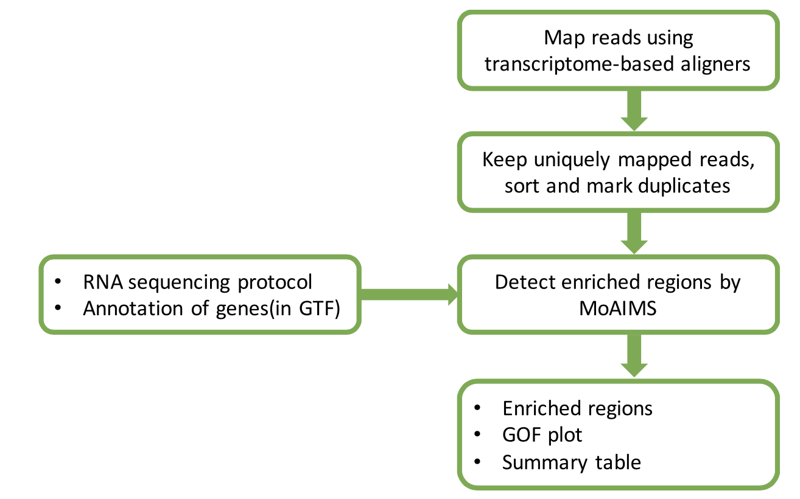

# MoAIMS

MoAIMS is an efficient software for detection of enriched regions of MeRIP-Seq. MoAIMS can also provide an intuitive indicator of treatment effect for the treatment MeRIP-Seq data.



# Installation
- Implemented language: R
- Version: 1.0
- Dependends: MASS,mgcv,ggplot2,dplyr,GenomicRanges,GenomicAlignments,GenomicFeatures,rtracklayer,Rsubread,mosaics
```R
#install.packages("devtools")
library(devtools)
install_github("rreybeyb/MoAIMS/codes")
```

  

# Example

- A simple run(test data provided in [moaims_extdata](https://drive.google.com/drive/folders/1oS47qt2ikiMJN9AAqqUgXUIXbf7XW9YW?usp=sharing))

  - Required inputs
    - sample_info_file: A sample sheet of sample information. Please see the required format in example/sample_sheet_exampe.tsv
    - gtf_file: Genome annotation file in sorted GTF format.
    - strand_specifc: Sequencing strand protocol. 0 for unstranded, 1 for fr-first, 2 for fr-second.
    - is_paired: Paired or not. TRUE or FALSE

  ```R
  > moaims(sample_info_file = /absolute/path/to/sample_info_file, gtf_file =/absolute/path/to/gtf_file,
    strand_specific = 1, is_paired = F, proj_name='test')
  ```
  - Primary output(See example/output/test)
    - Enriched regions in [BED12](https://genome.ucsc.edu/FAQ/FAQformat.html#format1) format(sig_*.bed). Definition of some specific columns are:

      1) 5th: the highest bin count of merged regions

      2) 13th: the highest fold change of merged regions

      3) 14th: the highest -log10(pvalue) of merged regions

    - Goodness of Fitting plot(GOF_*.png)

    - A summary table of models(fit_res_*.tsv)

- Need to adjust the model
  - Required inputs
    - bin_info_obj: Object of class *binInfo*, imported using method readBinInfo.
    - bin_count_obj:  Object of class *binCount*, imported using method readBinCount.
    - sample_id: Sample name.
  - Output(See example/output/test/adj)
  ```R
  #bin_info_*.tsv and bin_count_*.tsv are generated by the main function 'moaims' when setting output_intmd=T(default)
  > bin_info_obj=readBinInfo(in_fn = /absolute/path/to/bin_info_*.tsv)
  > bin_count_obj=readBinCount(in_fn = /absolute/path/to/bin_count_*.tsv)
  > adjFit(bin_info_obj,bin_count_obj,sample_id='test',proj_name='adj')
  ```

# Reference
- Kuan, P.F. et al. A Statistical Framework for the Analysis of ChIP-Seq Data. J Am Stat Assoc 106(495), 891–903 (2011)
- Bao, Y. et al. Accounting for immunoprecipitation efficiencies in the statistical analysis of ChIP-seq data. BMC Bioinformatics 14, 169 (2013)

